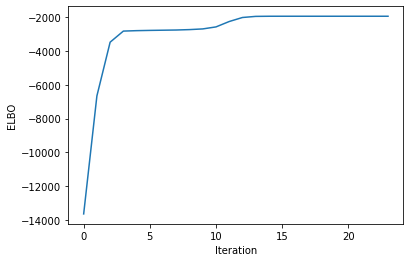

# Variational inference

We implement variational inference to identify a simple latent variable model.

Below are results of the *coordinate ascent variational inference* (CAVI) algorithm applied to a 1-D Gaussian mixture model with 5 mixture components and 500 observations.
CAVI identifies parameters by optimizing the ELBO. About 12 iterations are needed to achieve a local maximum.

